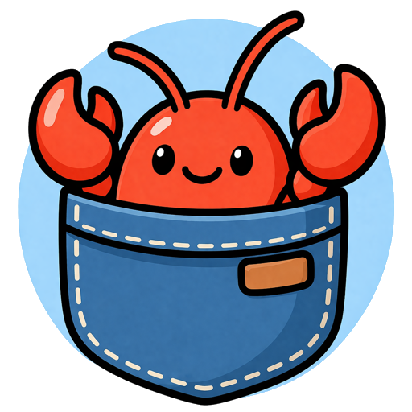

  

<h1 align="center">Pokeclaw</h1>

  <strong>The claw that actually ships 🚀</strong>

  

  <a href="./README.md">English</a> |
  <a href="./README.zh-CN.md">简体中文</a>

  <a href="#setup">Setup</a> •
  <a href="#what-is-pokeclaw">What Is Pokeclaw</a> •
  <a href="#core-principles">Core Principles</a> •
  <a href="#built-for">Built For</a> •
  <a href="#why-pokeclaw">Why Pokeclaw</a> •
  <a href="#what-makes-it-different">What Makes It Different</a> •
  <a href="#product-tradeoffs">Product Tradeoffs</a> •
  <a href="#under-the-hood">Under The Hood</a>

---

Pokeclaw is **the claw that actually ships**.  
It brings **execution, observability, control, collaboration, and self-improvement** together into a personal AI assistant built for sustained real work.

---

<table align="center">
  <tr align="center">
    <th>
Cronjob
</th>
    <th>
Introspection
</th>
    <th>
Subagent
</th>
  </tr>
  <tr>
    <td align="center">

</td>
    <td align="center">

</td>
    <td align="center">

</td>
  </tr>
</table>

## Setup

Send this to your AI coding assistant (such as Claude Code, Codex, or another similar tool):

> Read `docs/onboarding.md` and help me set up and run this project.

The onboarding flow currently includes Feishu/Lark setup, because Feishu/Lark is the only supported channel right now.

---

## ✨ What Is Pokeclaw

Pokeclaw is a personal AI assistant built for real work.  
It is not just a model wired into chat, and not just a pile of tools inside a bot.

Its goal is not to keep AI at the level of “responding to prompts”.  
Its goal is to push AI into **continuously moving work forward**.

In Pokeclaw, AI is not just something that answers questions.  
It is a system that can be delegated to, supervised, corrected, reviewed, and continuously improved.

In other words, Pokeclaw is not trying to look busy.  
It is trying to become an AI assistant that can actually move tasks forward and keep collaborating over time.

---

## 💫 Core Principles

### 🔭 Observability

The problem with most **Claw-like products** is not lack of capability.  
It is lack of visibility.

Once execution starts, you do not know what it is doing.  
You do not know whether it has drifted.  
You do not know whether it is stuck or still progressing.

Pokeclaw treats **observability** as a first-class capability:

- execution is not a black box
- tool calls, progress, and run state can be surfaced
- failures are explicit instead of silent
- users do not have to wait blindly for the final result
- the system can inspect its own runtime state, task state, and selected system records
- when needed, it can combine runtime logs with self-observation and self-diagnosis

### 🎛️ Controllability

A real AI assistant should not only run by itself.  
It should be interruptible, steerable, pausable, resumable, and correctable.

Pokeclaw is not about “full automation”.  
It is about **automation that remains under human control**:

- wrong direction can be corrected in time
- running tasks can be adjusted or stopped
- users never have to fully surrender control to the system
- automatic execution and human judgment stay connected

What makes an assistant trustworthy is not that it works on its own.  
It is that it works on its own **while staying under your control**.

### 🧠 Self-Harness

Pokeclaw does not just try to make AI remember information.  
It tries to help AI **learn how to work with you better over time**.

That is what **Self-Harness** is for.

It is not just memory, and it is not a few preferences appended to a file.  
It focuses on deeper signals:

- where users feel friction
- which failures keep repeating
- which collaboration mistakes should be removed permanently
- which lessons should become future default behavior

Its goal is not to make the system “look smarter”.  
Its goal is to make the system feel more like a truly aligned assistant.

Not just remembering what you said.  
But gradually learning **how to work in a way that fits you**.

### 🧭 Task Boundaries

Many **OpenClaw-like products** run into the same problem once they start carrying real work:

**everything gets pushed into the same chat stream.**

Research, coding, planning, reporting, and follow-ups end up sharing one context.  
Old tasks jump back into new conversations. Work quickly becomes messy.

Pokeclaw is not designed to cram more things into one window.  
It separates different layers of work:

- **Main Agent**: the persistent front door, coordinating everything like a chief of staff
- **SubAgent**: a long-lived collaboration space for a specific topic
- **TaskAgent**: a background execution unit that reports back when done

This is not an implementation detail.  
It is product structure.  
It decides whether AI collaboration becomes clearer or more chaotic over time.

### ⚙️ Unattended Execution

Many systems claim to support automation.  
The hard part is not whether they can start a task. The hard part is whether they can keep doing it well:

- can unattended work run reliably over time
- what happens when new permissions are needed
- what happens when execution fails
- can the system keep moving while the user is away

Pokeclaw is built around **real unattended execution**, not demo automation.

It is not only trying to answer “can it do the task?”  
It is trying to answer:

**can it keep doing the task in the real world, with real permissions, real interruptions, and real user habits?**

---

## 👥 Built For

Pokeclaw is currently best suited for:

- developers
- product managers
- indie builders
- technical users already working deeply with AI
- people with real needs around agents, automation, and long-term collaboration

This is not a product pretending to be for everyone on day one.  
It is for people who already feel these problems and genuinely want AI to do real work.

---

## 💥 Why Pokeclaw

We do not lack chat AI anymore.  
We do not lack tool-using AI anymore.  
We do not even lack AI that appears capable of everything.

What remains rare is something else:

- AI that is not a black box
- AI with clear task boundaries
- AI designed for long-term collaboration
- AI that is actually trustworthy with real work

Pokeclaw is not an attempt to make an existing Claw bigger.  
It is an attempt to rethink the **personal AI assistant** from the product structure up.

---

## 🦞 What Makes It Different

> ✨ **OpenClaw is fun, but Pokeclaw ships.**

Pokeclaw is not trying to compete on “bigger, broader, more channels, more platform”.

Because we believe what defines an AI assistant is not the feature list.  
It is the product structure.

Many Claws feel like platforms.  
Pokeclaw feels more like an assistant.

Many systems optimize for capability coverage.  
Pokeclaw optimizes for collaboration quality.

Many products can run tasks.  
Pokeclaw cares whether those tasks are **visible, controllable, sustainable, and trustworthy**.

We are not trying to build another bigger Claw.  
We are trying to build a Claw that actually gets things done.

---

## 🎯 Product Tradeoffs

Pokeclaw is not trying to integrate every channel from day one.  
And it does not believe “more integrations” automatically means “better product”.

For a personal AI assistant, the real question is not whether it can appear everywhere.  
The real question is whether it chooses surfaces that are **actually good for AI collaboration** and pushes those experiences deep enough.

That is why Pokeclaw cares more about:

- which channel best supports task collaboration
- which channel best supports status feedback
- which channel best supports control and interaction
- which channel best supports long-term AI work

It does not integrate surfaces just for compatibility.  
It makes product choices in service of **AI that can really do work**.

---

## 🛠️ Under The Hood

Pokeclaw is built with **TypeScript / Node.js**, designed around real task execution and long-running collaboration.

Its core is not one model trick.  
It is the interaction of several layers:

- Main Agent / SubAgent / TaskAgent separation
- runtime orchestration
- permission and approval flows
- observable runtime event streams
- Self-Harness
- scheduling and execution designed for real work

The tech stack is not the point.  
The point is that every technical choice serves the same product goal:

**making AI not just look capable, but remain capable over time in real work.**

---
